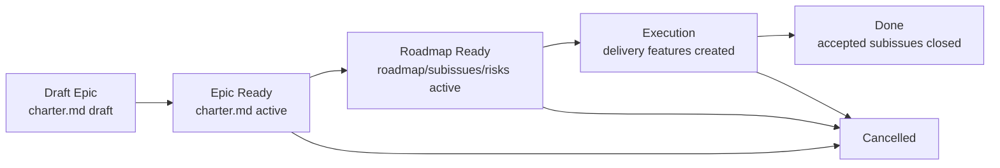

# Epic Flow

Epic - это управляемая инициатива крупнее одной delivery-feature. Он задаёт общий intent, границы, roadmap, решения, риски и subissue registry, но не подменяет feature package и не содержит code-level execution plan.

FPF-основание:

- **Bounded Contexts**: epic делит большую инициативу на смысловые контексты и delivery-slices, чтобы не смешивать бизнес, операции, финансы, UI/API и реализацию.
- **Strict Distinction**: epic, feature, PRD, use case, ADR и implementation plan имеют разные owners и не должны подменять друг друга.
- **Evidence Graph**: epic решения должны ссылаться на источники, stakeholder answers, specs, ADR или code facts.
- **Q-Bundle**: качество epic нельзя свести к одному score; оно проверяется набором отдельных свойств ниже.

## Package Rules

1. Все документы одного epic живут в `memory-bank/epics/EP-XXX/`.
2. `README.md` - routing layer и annotated index.
3. `brief.md` - опциональный intake-документ для ранней декомпозиции:
   problem, outcome, набросок scope и ссылки на candidate feature briefs. Он не
   заменяет `charter.md`.
4. `charter.md` - canonical owner intent: problem, outcome, scope/non-scope, stakeholder channels, source/evidence boundaries.
5. `roadmap.md` - execution order owner: waves, gates, dependencies, stop rules and handoff protocol.
6. `decision-log.md` - local decision ledger for decisions that affect the epic but do not require global ADR.
7. `subissues.md` - registry of candidate and accepted delivery subissues, each mapped to roadmap waves and source `SLICE-*`/`UC-*`.
8. `risks.md` - epic-level risk register for financial, operational, scope and delivery risks.
9. `design.md`, `specs/**`, `diagrams/**`, `source-docs/**` — опциональные knowledge-артефакты. Они допустимы только когда индексируются из epic package и подчиняются правилам knowledge-артефактов ниже.
10. `implementation-plan.md` не создаётся внутри epic. Code-level execution принадлежит отдельному package `memory-bank/features/FT-<issue>/`.
11. Для canonical epic docs используй templates from `memory-bank/flows/templates/epic/`.

## Layer Model

| Layer | Primary docs | Owns | Must NOT define |
| --- | --- | --- | --- |
| Intake | `brief.md` | ранний problem frame, outcome sketch, ссылки на candidate features | canonical scope, roadmap waves, feature acceptance contracts |
| Intent | `charter.md` | business/problem frame, scope, non-scope, source evidence, stakeholder channels | file paths, code steps, final implementation sequence |
| Roadmap | `roadmap.md`, `subissues.md` | waves, dependencies, issue candidates, handoff gates | final code plan, exact migrations, test commands |
| Governance | `decision-log.md`, `risks.md` | local decisions, risk controls, stop rules | global architecture policy unless promoted to ADR |
| Knowledge | `design.md`, `specs/**`, `diagrams/**`, linked `UC-*` | bounded contexts, source-backed specs, contracts, scenario coverage | delivery issue ownership or code execution |
| Execution | future `features/FT-<issue>/` | one approved delivery change with tests and rollout | reopening epic scope without updating epic owners |

## Правила Knowledge-Артефактов

Knowledge-артефакты существуют только для нормализации evidence в инициативе из нескольких фич. Они не заменяют `charter.md`, `roadmap.md`, `decision-log.md`, `subissues.md` или `risks.md`.

1. Любой markdown knowledge artifact внутри `memory-bank/epics/EP-XXX/` должен быть связан из package `README.md` или из linked epic owner document, чтобы reachability оставалась явной.
2. Markdown knowledge artifacts используют YAML frontmatter с `doc_kind: epic`, `doc_function: reference`, `status` и `derived_from`.
3. `derived_from` указывает на epic owner, чей факт нормализуется (`charter.md`, `roadmap.md`, `decision-log.md`, `subissues.md`, `risks.md`), и на external/source references, когда они релевантны.
4. Knowledge artifacts могут определять local reference IDs для source excerpts, context maps, diagrams или normalized specs, но не должны определять roadmap waves, subissue status, risk controls, accepted global architecture decisions или code execution steps.
5. `source-docs/**` используется для source-backed references или ссылок. Если source material копируется в repo как Markdown, он следует этим frontmatter и reachability rules.

## Lifecycle

## Transition Gates

### Bootstrap Epic

- [ ] `README.md` создан
- [ ] `charter.md` создан
- [ ] `implementation-plan.md` отсутствует
- [ ] если source docs уже известны, они отделены от derived specs

### Draft -> Epic Ready

- [ ] `charter.md` имеет `status: active`
- [ ] scope/non-scope explicit
- [ ] source/evidence boundaries explicit
- [ ] stakeholder channels and decision process recorded
- [ ] known out-of-scope topics recorded to prevent reopening

### Epic Ready -> Roadmap Ready

- [ ] `roadmap.md` active and names execution waves
- [ ] `subissues.md` active and maps candidates to waves/slices
- [ ] `risks.md` active and names controls/owners
- [ ] `decision-log.md` active when non-trivial decisions exist
- [ ] first delivery feature can be created without inventing epic-level facts

### Roadmap Ready -> Execution

- [ ] выбран один approved subissue or delivery slice
- [ ] created/selected GitHub issue is linked to epic package
- [ ] new `memory-bank/features/FT-<issue>/` package exists
- [ ] новый feature package импортирует только релевантные epic refs (`charter.md`, `roadmap.md`, `subissues.md`, `risks.md` и `decision-log.md`, если используется), а не весь epic scope
- [ ] feature `brief.md`, optional `design.md`, затем `implementation-plan.md` следуют `feature-flow.md`

## Quality Bundle

Epic quality is a Q-Bundle, not one scalar.

| Quality | What must be visible | Review question |
| --- | --- | --- |
| Traceability | Source docs, decisions, requirements, UC and subissues linked by stable IDs | Can a reviewer trace each planned feature back to evidence? |
| Decomposability | Bounded contexts and slices are separated | Can we create one delivery issue without dragging the whole epic? |
| Roadmap clarity | Waves, dependencies, gates and stop rules are explicit | Does the team know what should happen first and why? |
| Decision provenance | `decision-log.md` links facts, FPF reasoning and consequences | Is a decision backed by evidence rather than preference? |
| Scope control | Non-scope and stop rules are explicit | Can we prevent accidental expansion during delivery? |
| Risk governance | `risks.md` lists risks, controls and owners | Are high-impact financial/operator risks visible before code? |
| Execution handoff | `subissues.md` and roadmap define feature-package inputs | Can a slice owner start without re-reading the whole epic? |
| Evidence readiness | Open facts and confidence gaps are recorded | Do we know where facts are missing and who can close them? |
| Change control | Epic changes update owner docs before downstream plans | Will scope/design drift be caught before implementation? |

## Stable Identifiers

| Prefix | Meaning | Owner |
| --- | --- | --- |
| `EP-SI-*` | Epic subissue candidate or accepted subissue | `subissues.md` |
| `W*` | Roadmap wave | `roadmap.md` |
| `HG-*` | Handoff gate before feature execution | `roadmap.md` |
| `ERISK-*` | Epic-level risk | `risks.md` |
| `DL-*` | Local decision log entry | `decision-log.md` |
| `SLICE-*` | Candidate delivery slice | epic decomposition spec |

## Boundary Rules

1. Epic may define roadmap waves, but not file-level execution steps.
2. Epic may define subissue candidates, but does not make them implementation-ready until a delivery issue and feature package exist.
3. Epic may close local decisions with FPF and evidence. If a decision changes global project architecture, create ADR.
4. Feature package, созданный из epic, должен ссылаться на релевантные `EP-*` docs и сохранять stable IDs вместо копирования всего scope. `brief.md` импортирует problem/scope refs; `design.md` или ADR импортирует epic-local decisions, когда они влияют на solution space.
5. If a feature discovers a new epic-level fact, update the epic owner document first, then update the feature.
