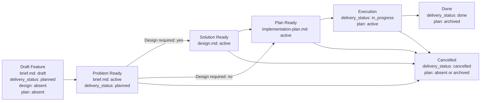

# Feature Flow

Этот документ задает порядок появления feature-артефактов. Агент должен вести feature package по стадиям и не создавать downstream-артефакты раньше, чем созрел их upstream-owner.

## Package Rules

1. Все документы одной фичи живут в `memory-bank/features/FT-XXX/`.
2. **Feature = vertical slice.** Одна фича — одна единица пользовательской ценности, пронизывающая все затронутые слои системы (UI, API, storage, infra). Горизонтальная нарезка ("все endpoints", "весь UI") допустима только для чисто инфраструктурных или рефакторинговых задач и должна быть явно обоснована через `NS-*`.
3. `brief.md` — canonical owner problem space: problem, outcome, scope, non-scope, assumptions, constraints, unresolved blocking decisions и canonical verify contract delivery-единицы.
4. `design.md` — conditional canonical owner solution space. Он создается только когда фича требует explicit design reasoning: selected design, C4/design decision, accepted feature-local decisions, contracts, invariants, failure modes, rollout/backout или ссылки на принятые ADR.
5. `README.md` создается вместе с `brief.md` и остается routing-слоем на всем lifecycle.
6. Lifecycle owner для `delivery_status` — только canonical `brief.md`. `design.md`, feature-level `README.md` и `implementation-plan.md` не дублируют это поле.
7. `design.md` появляется только после `Problem Ready` и только если `brief.md` фиксирует `Design required: yes`.
8. `implementation-plan.md` — derived execution-документ. В новых feature packages он не должен существовать, пока upstream owners не готовы: `brief.md` active и, если design required, `design.md` active.
9. Для canonical `brief.md`, canonical `design.md`, feature-level `README.md` и `implementation-plan.md` используй wrapper-шаблоны из `memory-bank/flows/templates/feature/`: сам template-файл имеет `doc_function: template`, а frontmatter/body инстанцируемого документа живут внутри embedded template contract.
10. Смысл стабильных идентификаторов (`REQ-*`, `SOL-*`, `SD-*`, `STEP-*` и т.д.) задается в секции «Stable Identifiers» ниже.
11. Acceptance scenarios (`SC-*`) покрывают vertical slice end-to-end: от входного события до наблюдаемого результата через все затронутые слои. Тестирование отдельного слоя в изоляции допустимо как implementation detail плана, но не заменяет end-to-end acceptance.
12. **Связь с task tracker.** При создании feature package агент обязан добавить в исходную задачу или ticket ссылку на `brief.md`, а после появления downstream-документов — ссылки на существующие `design.md` и `implementation-plan.md`.
13. Если фича является частью более крупной инициативы, `brief.md` может зависеть от PRD из `memory-bank/prd/`, но PRD не заменяет сам feature package.
14. Если фича создает новый устойчивый сценарий проекта или materially changes существующий, соответствующий `UC-*` в `memory-bank/use-cases/` должен быть создан или обновлен до closure.
15. Optional feature-support docs (`runtime-surfaces.md`, `ui-reference/README.md`, `use-cases/README.md`) допустимы для сложных фич как grounding / review / traceability aids. Они не становятся canonical owner problem space, solution space, acceptance inventory или execution sequencing.
16. Если фича зависит от upstream-документа инициативы, `brief.md` импортирует только релевантные upstream-ссылки, а не весь upstream scope.
17. Если работа крупнее одной delivery-feature и требует roadmap, risk register или нескольких delivery units, не расширяй feature package; выбери подходящий upstream flow из `memory-bank/flows/` и веди каждую утвержденную delivery-единицу как отдельный feature package.

## Шаблон `brief.md`

Новые feature packages используют один problem-space template: `memory-bank/flows/templates/feature/brief.md`.

`brief.md` масштабируется содержанием:

- компактная фича заполняет минимальный набор `REQ-*`, `NS-*`, `SC-*`, `CHK-*`, `EVID-*`;
- сложная problem-space часть добавляет `MET-*`, `ASM-*`, `CON-*`, `DEC-*`, `NEG-*`, несколько acceptance scenarios, richer traceability и evidence contract;
- solution-space complexity не расширяет `brief.md`; для выбранного подхода, contracts, C4, failure modes и rollout/backout используется sibling `design.md`.

Если problem-space сложный, расширяй тот же `brief.md` содержанием, а не выбирай другой template.

## Когда Нужен `design.md`

`brief.md` обязан фиксировать **Design Requirement Decision** до перехода в `Problem Ready`: `Design required: yes/no` и короткую причину. Это не selected design, а gate decision для выбора downstream path.

`design.md` обязателен, если выполняется хотя бы одно условие:

1. feature меняет API, event, schema, file format, CLI, env/config contract, background job topology, queue/storage boundary, security boundary, financial calculation, integration contract или operational rollout;
2. solution требует alternatives/trade-off reasoning, ADR dependency, C4/data-flow diagram, migration strategy, rollout/backout design или explicit failure-mode design;
3. `implementation-plan.md` иначе должен был бы принимать architecture decisions, contracts или invariants перед тем, как расписать steps;
4. feature имеет design-pack из нескольких артефактов; `design.md` должен индексировать их и указать owner-а каждого design fact.

Если change остается локальным, не меняет runtime/interface/contract boundary и решение очевидно из существующего паттерна, `design.md` можно не создавать. В этом случае `brief.md` фиксирует `Design required: no` и причину; `implementation-plan.md` не должен изобретать solution facts.

## C4 Analysis Requirements

Если `design.md` required, он обязан зафиксировать **C4 applicability decision** до `Solution Ready`: какой минимальный C4 level нужен, или почему C4 не нужен. Цель правила — не рисовать диаграммы ради диаграмм, а явно проверить architecture boundaries до execution plan.

### Когда C4 Не Нужен

C4 можно не создавать, если изменение одновременно:

1. остается внутри одного уже существующего компонента/модуля;
2. не меняет API/event/schema/file format/env/queue/storage/integration/security boundary;
3. не вводит новый runtime/deployable/container или новый background execution path;
4. не перераспределяет ответственность между bounded contexts, engines, services или внешними системами.

В этом случае `design.md` фиксирует `C4-00: not required` и короткую причину.

### Минимальный Уровень C4

| Trigger в design analysis | Required C4 level | Что показать |
| --- | --- | --- |
| Меняется взаимодействие пользователя, внешней системы, внешнего API, payment/fiscal/KYT/AML/provider integration или trust boundary с системой | C1 System Context | Система, actor/external systems, direction of interaction, trust/data boundary |
| Меняется runtime/deployable/container boundary: frontend/backend, app/worker, queues, cache/storage, Docker/Kubernetes/CI | C2 Container | Containers/runtime nodes, data stores, queues, protocols, ownership of data flow |
| Меняется внутренняя декомпозиция внутри одного container: application services/readers/writers, orchestration, state machine, domain module split, shared component boundary, financial/security-critical collaboration | C3 Component | Components/modules inside the container, responsibilities, call/event/data direction |
| Нужно объяснить class-level design как architecture decision: framework extension, reusable library contract, non-trivial algorithm object graph, concurrency/locking primitive | C4 Code | Только critical classes/interfaces and relationships; не использовать для обычных CRUD/service changes |

Если trigger попадает в несколько строк, выбирается самый глубокий требуемый уровень и сохраняется traceability к более верхним границам.

### C4 Artifact Rules

1. C4 artifact может быть Mermaid, PlantUML, Structurizr DSL, image или markdown table, если он однозначно передает выбранный C4 level.
2. C4 artifact входит в design-pack и индексируется из `design.md`.
3. C4 artifact не должен содержать execution steps, file-level TODO или test commands.
4. Если C4 level required, `Solution Ready` недостижим без artifact-а или ссылки на уже существующий canonical C4/design artifact, который покрывает affected boundary.

## Optional Feature Support Docs

Support docs создаются только когда они снимают реальную неоднозначность или делают review существенно точнее. Они являются `doc_kind: feature-support` и `doc_function: reference` / `index`, если иное явно не обосновано.

| Support doc | Когда создавать | Что фиксирует | Чего не владеет |
| --- | --- | --- | --- |
| `runtime-surfaces.md` | Фича затрагивает несколько runtime entrypoints, concrete surfaces, semantic mappings, fallback/error paths или context variants | current surface inventory, semantic mapping, adjacent out-of-scope surfaces, target mapping reference, context matrix, resolution / decision table, observability notes | requirements, selected design, acceptance criteria, implementation sequence |
| `ui-reference/README.md` | Фича меняет интерфейс, authoring flow, navigation, screen states или preview / editor UX | generic interface reference: screen map, interaction states, component expectations, copy/state semantics, mockup links and UI traceability | project-specific UI framework rules, product requirements, selected architecture, implementation steps |
| `ui-reference/mockups/*.md` или другой linkable artifact | Любое interface change требует хотя бы low-fidelity mockup; default format — Markdown, но допустимы images, design-tool links или other artifacts, если они versionable / linkable | screen sketch, state examples, interaction notes | canonical acceptance inventory или final visual design system |
| `use-cases/README.md` | Сценариев много, есть distinct happy/edge/error journeys, несколько user roles или нужен review-friendly `FUC -> REQ -> CHK` mapping | derived user-facing scenarios, edge/error cases, candidate test cases, traceability back to canonical refs | canonical `SC-*`, `NEG-*`, `CHK-*`, `EVID-*` |

Support docs должны ссылаться на canonical owners и явно писать, что они не подменяют `brief.md`, `design.md` или `implementation-plan.md`. Если support doc обнаруживает изменение scope, acceptance, selected design или execution sequence, сначала обновляется соответствующий canonical owner.

## Migration Strategy

- Новые feature packages обязаны сразу следовать структуре `brief.md -> optional design.md -> implementation-plan.md`.
- При миграции старого package layout сначала назначь canonical owners: problem-space content переносится в `brief.md`, required solution-space content — в `design.md`.
- После миграции package не должен сохранять duplicate active owners для problem space или solution space.
- Миграция может происходить постепенно, package-by-package.

## Lifecycle

## Transition Gates

Каждый gate — набор проверяемых предикатов. Переход допустим тогда и только тогда, когда все предикаты истинны.

### Bootstrap Feature Package

- [ ] `README.md` создан по шаблону `templates/feature/README.md`
- [ ] `brief.md` создан по шаблону `templates/feature/brief.md`
- [ ] `design.md` отсутствует
- [ ] `implementation-plan.md` отсутствует

### Draft Feature → Problem Ready

- [ ] `brief.md` → `status: active`
- [ ] секция `What` содержит ≥ 1 `REQ-*` и ≥ 1 `NS-*`
- [ ] секция `Verify` содержит ≥ 1 `SC-*`
- [ ] каждый `REQ-*` прослеживается к ≥ 1 `SC-*` через traceability matrix
- [ ] секция `Verify` содержит ≥ 1 `CHK-*` и ≥ 1 `EVID-*`
- [ ] если deliverable нельзя принять без negative/edge coverage → ≥ 1 `NEG-*`
- [ ] `brief.md` содержит Design Requirement Decision: `Design required: yes/no` и причину
- [ ] `brief.md` не содержит accepted solution decisions, `How`, to-be C4 architecture model, `Change Surface`, solution-level `Flow`, `CTR-*`, `FM-*`, `RB-*` или rollout/backout prose

### Problem Ready → Solution Ready

- [ ] `brief.md` фиксирует `Design required: yes`
- [ ] `design.md` создан по шаблону `templates/feature/design.md`
- [ ] `design.md` → `status: active`
- [ ] `design.md` содержит ≥ 1 `SOL-*`
- [ ] `design.md` ссылается минимум на один canonical `REQ-*` из sibling `brief.md`
- [ ] `design.md` фиксирует C4 applicability decision; если C4 level required, C4 artifact или ссылка на canonical C4/design artifact присутствует в design-pack
- [ ] selected design стабилизирован настолько, что downstream execution sequencing больше не конкурирует с ним за ownership
- [ ] accepted feature-local decisions перенесены в `SD-*`, а architectural / reusable / cross-feature decisions оформлены в accepted ADR
- [ ] если solution зависит от ADR, соответствующий ADR имеет `decision_status: accepted`
- [ ] для нового feature package `implementation-plan.md` отсутствует; для migrated package с уже существующим планом разрешено создать `design.md`, после чего план должен быть обновлён так, чтобы ссылаться на canonical solution refs до следующего существенного execution update

### Upstream Ready → Plan Ready

- [ ] агент выполнил grounding: прошёлся по текущему состоянию системы (relevant paths, existing patterns, dependencies) и зафиксировал результат в discovery context секции `implementation-plan.md`
- [ ] если `brief.md` фиксирует `Design required: yes`, sibling `design.md` имеет `status: active`
- [ ] если `brief.md` фиксирует `Design required: no`, `implementation-plan.md` не принимает architecture decisions, contracts или invariants
- [ ] `implementation-plan.md` создан по шаблону `templates/feature/implementation-plan.md`
- [ ] `implementation-plan.md` → `status: active`
- [ ] `implementation-plan.md` содержит ≥ 1 `PRE-*`, ≥ 1 `STEP-*`, ≥ 1 `CHK-*`, ≥ 1 `EVID-*`
- [ ] discovery context в `implementation-plan.md` содержит: relevant paths, local reference patterns, unresolved questions (`OQ-*`), test surfaces и execution environment
- [ ] шаги и workstreams в `implementation-plan.md` ссылаются на canonical IDs из `brief.md` и, если design layer существует, solution refs из `design.md` / ADR

### Plan Ready → Execution

- [ ] `brief.md` → `delivery_status: in_progress`
- [ ] если `design.md` существует, он имеет `status: active`
- [ ] `implementation-plan.md` → `status: active`
- [ ] `implementation-plan.md` фиксирует test strategy: automated coverage surfaces, required local/CI suites
- [ ] каждый manual-only gap имеет причину, ручную процедуру и `AG-*` с approval ref

### Execution → Done

- [ ] все `CHK-*` из `brief.md` имеют результат pass/fail в evidence
- [ ] все `EVID-*` из `brief.md` заполнены конкретными carriers (путь к файлу, CI run, screenshot)
- [ ] delivered behavior не противоречит accepted `SOL-*` / `SD-*` / ADR refs, если design layer существует
- [ ] automated tests для change surface добавлены или обновлены
- [ ] required test suites зелёные локально и в CI
- [ ] каждый manual-only gap явно approved человеком (approval ref в `AG-*`)
- [ ] simplify review выполнен: код минимально сложен или complexity обоснована ссылкой на `CON-*`, `FM-*`, `SD-*` или accepted ADR
- [ ] если feature добавляет новый stable flow или materially changes существующий project-level scenario, соответствующий `UC-*` создан или обновлен и зарегистрирован в `memory-bank/use-cases/README.md`
- [ ] `brief.md` → `delivery_status: done`
- [ ] `implementation-plan.md` → `status: archived`

### → Cancelled (из любой стадии после Draft Feature)

- [ ] `brief.md` → `delivery_status: cancelled`
- [ ] `implementation-plan.md` отсутствует ∨ `status: archived`

## Boundary Rules

1. `brief.md` обязан содержать секции `What` и `Verify`.
2. `brief.md` владеет только problem space: problem, outcome, scope, non-scope, assumptions, constraints, unresolved blocking decisions, Design Requirement Decision и canonical verify contract.
3. `brief.md` не должен содержать `How`, selected design, to-be C4 architecture model, accepted solution decisions, change surface, internal flow, concrete solution contracts, solution-level failure modes, rollout/backout semantics или execution sequencing.
4. `DEC-*` в `brief.md` означает только unresolved blocking decisions. Как только решение принято, оно переезжает в `design.md` как `SD-*` или в ADR.
5. `design.md`, если нужен, владеет только solution space: selected design, C4 applicability/artifacts, accepted feature-local decisions, solution structure, internal flow, concrete contracts, invariants, solution-level failure modes, local rollout/backout semantics и ссылки на принятые ADR.
6. `delivery_status` остается только на `brief.md`; `design.md` и `implementation-plan.md` не дублируют lifecycle state delivery-единицы.
7. `design.md` не должен переопределять business requirements, scope, acceptance criteria, canonical checks, evidence contract, detailed current-system inventory или execution sequencing.
8. Feature-support docs не должны переопределять canonical facts. Они могут давать surface inventory, UI reference, mockups, derived use cases и review mappings только как support context.
9. Если feature зависит от ADR, canonical owner этой зависимости — `design.md`; `proposed` ADR не считается finalized design.
10. Если feature зависит от канонического use case, `brief.md` ссылается на соответствующий файл в `memory-bank/use-cases/`. Use case остается owner-ом trigger/preconditions/main flow/postconditions на уровне проекта, а `brief.md` фиксирует только slice-specific проблему и verify.
11. `implementation-plan.md` остается derived execution-документом: он ссылается на canonical IDs из `brief.md` и, если есть, solution refs из `design.md` / ADR, фиксирует discovery context и test strategy для исполнения и не переопределяет scope, selected design, C4 architecture model, blockers, acceptance criteria или evidence contract.
12. Если меняются scope, assumptions, constraints, acceptance criteria или evidence contract, сначала обновляется `brief.md`. Если меняются selected design, to-be C4 architecture model, local accepted decisions, contracts, failure modes или rollout/backout semantics, сначала обновляется `design.md` или ADR. Только потом обновляется downstream-план.
13. Если support doc выявляет конфликт с canonical owner, конфликт нельзя решать внутри support doc: обнови `brief.md`, `design.md`, ADR или `implementation-plan.md` по ownership.
14. Если численный target threshold относится только к одной delivery-единице, canonical owner — соответствующий `brief.md`. Поднимать такой KPI в project-level документ можно только после того, как он стал shared upstream fact для нескольких feature.
15. Хороший `implementation-plan.md` начинается с discovery context: relevant paths, local reference patterns, unresolved questions, test surfaces и execution environment должны быть зафиксированы до sequencing изменений.
16. Для рискованных, необратимых или внешне-эффективных действий `implementation-plan.md` должен явно описывать human approval gates и не скрывать их внутри prose шага.
17. Если feature исполняет часть upstream initiative, `brief.md` должен ссылаться только на релевантные upstream artifacts и imported IDs, а не копировать весь upstream scope. Если используются upstream solution decisions, `design.md` или ADR ссылается на их canonical owner.
18. Upstream roadmap, cross-feature risks и delivery-unit registries принадлежат upstream owner-документам, а не feature package.

## Test Ownership Summary

Canonical testing policy живёт в [../engineering/testing-policy.md](../engineering/testing-policy.md). Ниже — выжимка, достаточная для создания feature package без обращения к policy-документу.

1. **Canonical test cases** delivery-единицы задаются в `brief.md` через `SC-*`, feature-specific `NEG-*`, `CHK-*` и `EVID-*`.
2. `design.md`, если нужен, может фиксировать solution-level `CTR-*`, `INV-*`, `FM-*` и `RB-*`, но не владеет test strategy и не подменяет canonical verify contract.
3. `implementation-plan.md` владеет только стратегией исполнения: какие suites добавить, какие gaps временно manual-only и почему.
4. **Sufficient coverage** = покрыт основной changed behavior, новые или измененные contracts из `design.md` / ADR, критичные failure modes из `FM-*` и feature-specific negative/edge scenarios, если они меняют verdict. Процент line coverage сам по себе недостаточен.
5. **Manual-only допустим** только как явное исключение (live infra, hardware, недетерминированная среда). Для каждого gap — причина, ручная процедура или `EVID-*`, owner follow-up и approval ref через `AG-*`.
6. **К Problem Ready** `brief.md` уже фиксирует test case inventory: минимум один `SC-*`, traceability к `REQ-*` и Design Requirement Decision. **К Solution Ready** required `design.md` фиксирует delivered design, C4 applicability, contracts и local decisions. **К Done** — automated tests добавлены, обязательные suites зелёные локально и в CI.
7. **Simplify review** — отдельный проход после функциональных тестов, до closure. Цель: убедиться, что код минимально сложен. Три похожие строки лучше premature abstraction. Complexity оправдана только со ссылкой на `CON-*`, `INV-*`, `FM-*`, `SD-*` или accepted ADR.
8. **Verification context separation** — функциональная верификация, simplify review и acceptance test — три логически отдельных прохода. Между проходами агент формулирует выводы до начала следующего. Для small features допустимо в одной сессии, но simplify review не пропускается.

## Stable Identifiers

### Feature IDs

| Prefix | Meaning | Used in |
| --- | --- | --- |
| `MET-*` | outcome-метрики | `brief.md` |
| `REQ-*` | scope и обязательные capability | `brief.md` |
| `NS-*` | non-scope | `brief.md` |
| `ASM-*` | assumptions и рабочие предпосылки | `brief.md` |
| `CON-*` | ограничения problem space | `brief.md` |
| `DEC-*` | unresolved blocking decisions | `brief.md` |
| `EC-*` | exit criteria | `brief.md` |
| `SC-*` | acceptance scenarios | `brief.md` |
| `NEG-*` | negative / edge test cases | `brief.md` |
| `CHK-*` | проверки | `brief.md`, `implementation-plan.md` |
| `EVID-*` | evidence-артефакты | `brief.md`, `implementation-plan.md` |
| `RJ-*` | rejection rules | `brief.md`, `implementation-plan.md` |

### Solution IDs

| Prefix | Meaning | Used in |
| --- | --- | --- |
| `SOL-*` | solution elements / selected design blocks | `design.md` |
| `ALT-*` | considered alternatives | `design.md` |
| `TRD-*` | trade-offs | `design.md` |
| `C4-*` | C4 applicability decision, model levels, elements или relationships | `design.md` |
| `SD-*` | accepted feature-local solution decisions | `design.md` |
| `INV-*` | solution invariants | `design.md` |
| `CTR-*` | concrete solution contracts | `design.md` |
| `FM-*` | solution-level failure modes | `design.md` |
| `RB-*` | rollout / backout stages | `design.md` |

### Plan IDs

| Prefix | Meaning | Used in |
| --- | --- | --- |
| `PRE-*` | preconditions | `implementation-plan.md` |
| `OQ-*` | unresolved questions / ambiguities | `implementation-plan.md` |
| `WS-*` | workstreams | `implementation-plan.md` |
| `AG-*` | approval gates for risky actions | `implementation-plan.md` |
| `STEP-*` | атомарные шаги | `implementation-plan.md` |
| `PAR-*` | параллелизуемые блоки | `implementation-plan.md` |
| `CP-*` | checkpoints | `implementation-plan.md` |
| `ER-*` | execution risks | `implementation-plan.md` |
| `STOP-*` | stop conditions / fallback | `implementation-plan.md` |

### Support IDs

| Prefix | Meaning | Used in |
| --- | --- | --- |
| `SURF-*` | runtime surfaces / entrypoints / concrete render or processing surfaces | `runtime-surfaces.md` |
| `MAP-*` | semantic mapping rows or mapping rules | `runtime-surfaces.md` |
| `UI-*` | interface screens, states, controls or interaction elements | `ui-reference/README.md` |
| `FUC-*` | derived feature-local use cases | `use-cases/README.md` |
| `TC-*` | derived test case candidates | `use-cases/README.md`, support docs |

### Required Minimum

1. Любой canonical `brief.md` использует как минимум `REQ-*`, `NS-*`, `SC-*`, `CHK-*`, `EVID-*`.
2. Любой `brief.md` со `status: active` задает хотя бы один explicit test case через `SC-*`.
3. `brief.md` может использовать только минимальный problem-space набор для small feature или расширенный набор feature IDs по необходимости; отдельные problem-space templates не используются.
4. Любой required `design.md` использует как минимум один `SOL-*`, один `C4-*` decision и связывает их минимум с одним `REQ-*` из sibling `brief.md`.
5. Любой `design.md` фиксирует selection rationale для C4 applicability; выбранные C4 views используют `C4-*` и связываются с `SOL-*`, `SD-*`, `CTR-*`, `INV-*` или ADR refs.
6. Любой `design.md`, где есть принятые feature-local решения, использует `SD-*`; `ALT-*`, `TRD-*`, `CTR-*`, `INV-*`, `FM-*` и `RB-*` применяются только когда соответствующая solution-semantics действительно нужна.
7. Любой optional support doc использует только local support IDs и traceability к canonical refs; он не вводит новые canonical `REQ-*`, `SC-*`, `CHK-*` или `EVID-*`.
8. Любой `implementation-plan.md` использует как минимум `PRE-*`, `STEP-*`, `CHK-*`, `EVID-*`; при наличии ambiguity или human approval gates используются `OQ-*` и `AG-*`.

### Traceability Contract

1. Scope в `brief.md` фиксируется через `REQ-*`, non-scope через `NS-*`.
2. Verify в `brief.md` связывает `REQ-*` с test cases через `Acceptance Scenarios`, feature-specific `NEG-*`, `Traceability matrix`, `Test matrix` и `Evidence contract`.
3. `design.md`, если есть, связывает `REQ-*` из `brief.md` с `SOL-*`, `ALT-*`, `TRD-*`, `C4-*`, `SD-*`, `CTR-*`, `INV-*`, `FM-*`, `RB-*` и accepted ADR refs.
4. `implementation-plan.md` ссылается на canonical IDs из `brief.md` и, если есть, solution refs из `design.md` / ADR в колонках `Implements`, `Verifies` и `Evidence IDs`.
5. Если sequencing блокируется неизвестностью, план фиксирует её как `OQ-*`, а не прячет в prose.
6. Если выполнение требует человеческого подтверждения для рискованных действий, план фиксирует это через `AG-*`.
7. Если design или to-be C4 architecture model меняется после `Solution Ready`, сначала обновляется `design.md` или ADR, затем план.
